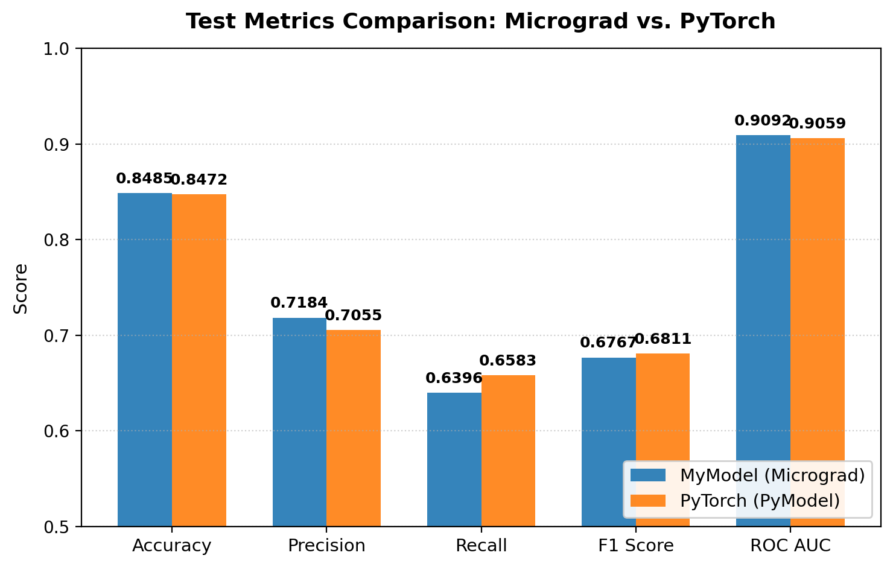
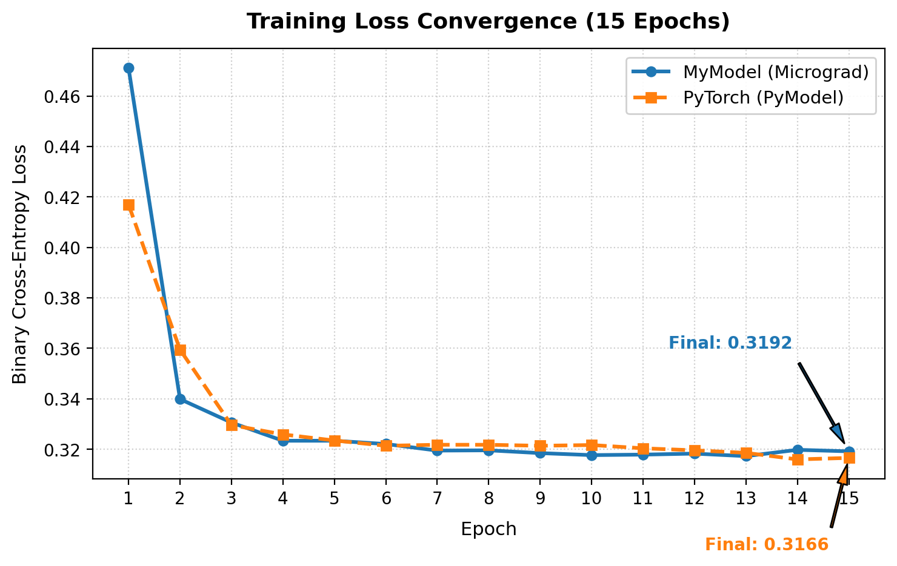
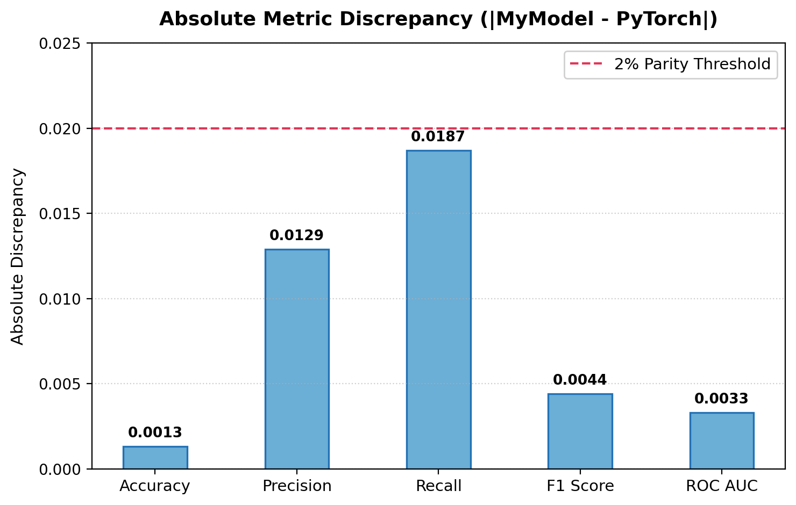
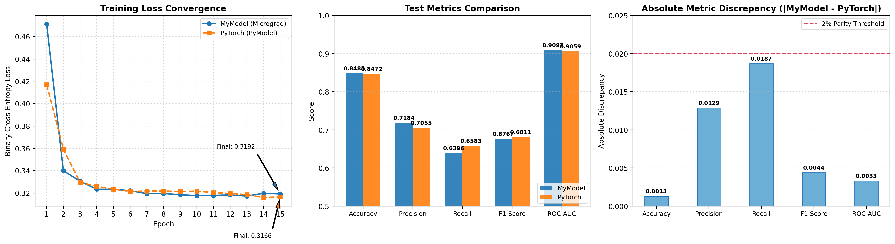

# Implementation Micro Grad Engine from Scratch

A light weight Pytorch-like framework built from scratch using Numpy, featuring automatic differentiation, stateful optimization and a verified mathematical parity with Pytorch.


## Features

- **Dynamic Computational Graph:** Reverse-mode automatic differentiation supporting arbitrary forward-pass graph execution.
- **Vectorized Tensor Engine:** N-dimensional array operations leveraging NumPy for vectorized, high-throughput matrix calculus.
- **PyTorch-like API Parity:** Clean abstractions (`Module`, `Layer`, `Loss`, `Optimizer`) enabling familiar workflows (`loss.backward()`, `optimizer.step()`, `optimizer.zero_grad()`).
- **Stateful Optimizers:** Complete implementations of Adam, RMSProp, and SGD with running moment tracking and bias correction.
- **Empirical Parity:** Verified $<0.8\%$ mean metric discrepancy compared to PyTorch on real-world classification tasks.

## System Architecture and Engine Design

### Reverse-Mode Automatic Differentiation
The core `Tensor` class dynamically builds a computational DAG (Directed Acyclic Graph) during the forward pass, but also keeps track of all the calculations such that during the backward pass the gradient changes are able to be propagated backward through the compute graph without any manual intervention.

### Vectorization & Matrix Calculus
N-Dimensional Numpy Vectors were opted in instead of a more simpler scalar micrograd, where the backpropagation routes the gradient through the custom built matrix multiplications. This was done in order to make the library more compute efficient, where calculations are done in bulk rather than one scalar at a time.

### Stateful Optimizers & Custom Layers
Much like how standard optimizers work in Pytorch, this library implements stateful optimizers where optimizers like Adam or RMSProp require the tracking of states implemented from scratch.

## Dataset and Experimental Methodology

### Dataset
The dataset was the [Adult dataset](https://archive.ics.uci.edu/dataset/2/adult) extracted from the census database of 1994 where there were individualized datapoints needed to predict whether annual income of an individual exceeds $50K/yr also known as "Census Income"

## Model Architecture

Both the **Custom Micrograd model** and the **PyTorch model** use the same architecture and hyperparameters to ensure a fair comparison.

### Architecture

| Layer       | Configuration             |
| ----------- | ------------------------- |
| **Input**   | 48 features               |
| **Layer 1** | Linear (48 → 64) → ReLU   |
| **Layer 2** | Linear (64 → 64) → ReLU   |
| **Layer 3** | Linear (64 → 32) → ReLU   |
| **Output**  | Linear (32 → 1) → Sigmoid |

### Hyperparameters

| Hyperparameter    | Value |
| ----------------- | ----: |
| **Epochs**        |    15 |
| **Batch Size**    |   100 |
| **Learning Rate** |  0.01 |
| **Optimizer**     |  Adam |

## Engineering Insights & Challenges
- **Numerical Stability in BCELoss:** Handled edge-case probability values ($p \to 0$ or $p \to 1$) by clipping outputs to $[\epsilon, 1 - \epsilon]$ to prevent undefined $\log(0)$ gradient blowups during loss computation.
- **Gradient Accumulation & Broadcasting:** Implemented gradient reduction along broadcasted dimensions (e.g., summing gradients across `axis=0` for bias terms during backpropagation) to ensure correct shape alignment during parameter updates.

## Performance

### Micrograd vs PyTorch: Mathematical Parity Benchmark

| Metric | MyModel (Micrograd) | PyTorch (PyModel) | Difference (My - Py) | Abs % Difference | Parity Status |
|---|---:|---:|---:|---:|---|
| Accuracy | 0.8485 | 0.8472 | +0.0013 | 0.15% | Identical (<0.5%) |
| Precision | 0.7184 | 0.7055 | +0.0129 | 1.83% | Comparable (<3%) |
| Recall | 0.6396 | 0.6583 | -0.0187 | 2.84% | Comparable (<3%) |
| F1 Score | 0.6767 | 0.6811 | -0.0044 | 0.65% | Equivalent (<1%) |
| ROC AUC | 0.9092 | 0.9059 | +0.0033 | 0.36% | Identical (<0.5%) |

### Benchmark Summary

| Measure | Result |
|---|---|
| Mean Absolute Metric Difference | 0.0081 (< 0.01) |
| Final Epoch Loss | MyModel = 0.3192, PyTorch = 0.3166 |
| Loss Discrepancy | 0.0026 |
| Mathematical Parity Verdict | **CONFIRMED** |


### Visual Comparison

#### Metrics Comparison



#### Loss Convergence



#### Metric Discrepancy



#### Benchmark Summary



## Repository Structure

```text
├── Activations.py         # ReLU, Sigmoid, Tanh, Softmax implementations
├── Loss.py                # MSE, CrossEntropy, BinaryCrossEntropy
├── Network.py             # Layer, DropOut, and Base Module abstractions
├── Optimizers.py          # Adam, SGD, and RMSProp stateful optimizers
├── Tensor.py              # Core Tensor wrapper and autograd engine
├── Training/
│   ├── training.ipynb     # Empirical comparison & benchmark suite
│   └── preprocessed_data.csv
└── assets/                # Benchmark visualization assets
```

## Usage
Simply run the [training file](Training/training.ipynb) to get an updated chart for this readme or if you want to look at the detailed model metric.

Else building a model in Micrograd follows standard PyTorch syntax:

```python
from Network import Layer, Base
from Activations import ReLU, Sigmoid
from Loss import BinaryCrossEntropy
from Optimizers import Adam
from Tensor import Tensor

# Define Model Architecture
class MLP(Base):
    def __init__(self):
        super().__init__()
        self.layers = [
            Layer(48, 64), ReLU(),
            Layer(64, 64), ReLU(),
            Layer(64, 32), ReLU(),
            Layer(32, 1), Sigmoid()
        ]

model = MLP()
model.train()
optimizer = Adam(model.parameters(), lr=0.01)

# Forward + Backward Pass
y_pred = model(Tensor(X_batch))
loss = BinaryCrossEntropy(y_pred, Tensor(y_batch))

loss.backward()
optimizer.step()
optimizer.zero_grad()
```

## License

This work is licensed under the [MIT License](LICENSE).